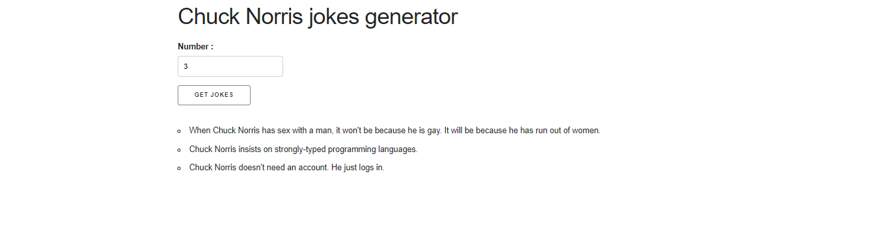
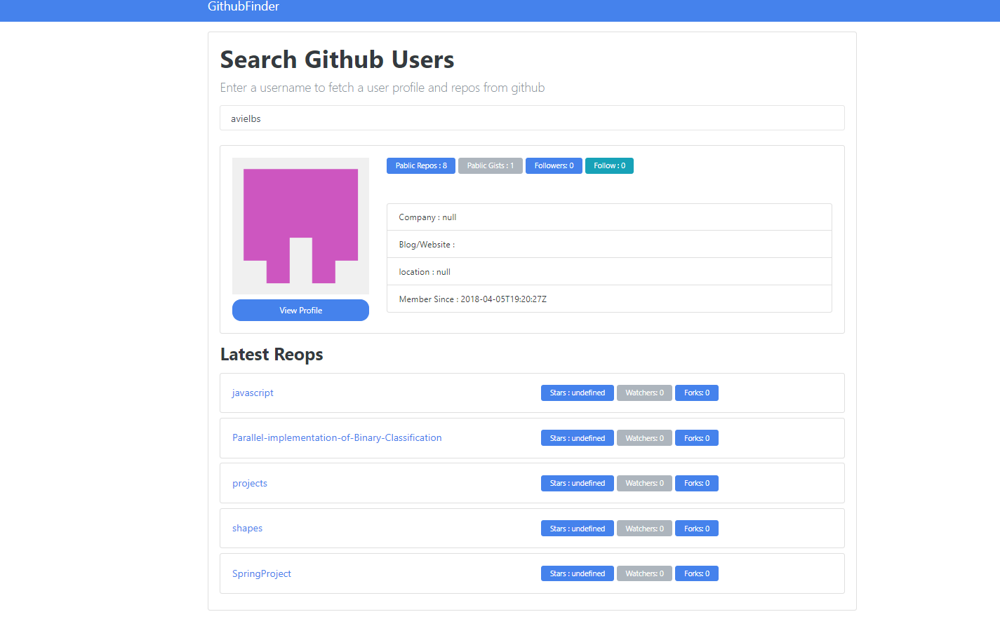

# javascript

Chuck Norris project -
Using javascript,html and bootstrap make an ajax request to API that generate random Chuck Norris Jokes.

Github User Finder  -
Using javascript,html and bootstrap make an ajax request to Github Users and Repositories api ,
by starting to type the github user name you can see some details about the user and his last repositories.

